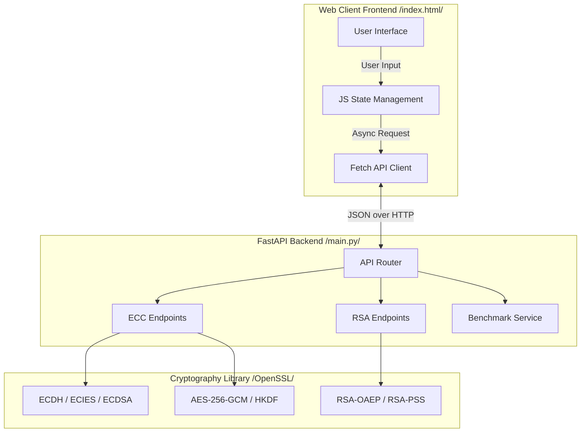

# CO600B Security in Computing: Project Report
## ECC vs RSA Secure Communication Demonstration

**Date:** March 2026

---

## 1. Introduction

Cryptography is the foundation of secure communication in the digital age. It ensures confidentiality, integrity, authentication, and non-repudiation of data transmitted over insecure networks like the Internet. Modern public-key cryptography (asymmetric cryptography) allows two parties to establish secure communication without sharing a secret key in advance.

This project demonstrates and compares the two most widely used asymmetric cryptographic algorithms: **RSA (Rivest-Shamir-Adleman)** and **ECC (Elliptic Curve Cryptography)**. Through a functional web application, we implement key exchange, encryption/decryption, and digital signatures for both algorithms to analyze their performance characteristics and practical applications.

---

## 2. RSA Algorithm

Introduced in 1977, RSA is the most widely deployed public-key cryptosystem. Its security is based on the **Integer Factorization Problem**—the mathematical difficulty of factoring the product of two very large prime numbers.

### Key Characteristics:
*   **Key Generation:** Involves finding two large primes ($p$ and $q$) and computing their product $n = p \times q$. The public key is $(n, e)$ and the private key is $(n, d)$.
*   **Encryption (RSA-OAEP):** Ciphertext $C = M^e \pmod n$. We use Optimal Asymmetric Encryption Padding (OAEP) to prevent chosen-ciphertext attacks.
*   **Signatures (RSA-PSS):** Signature $\sigma = \text{hash}(M)^d \pmod n$. Probabilistic Signature Scheme (PSS) adds randomized padding for provable security.
*   **Drawback:** As computing power increases, RSA key sizes must grow exponentially to maintain security (e.g., from 1024-bit to 2048-bit to 4096-bit), leading to slower operations and higher bandwidth overhead.

---

## 3. ECC Algorithm

Elliptic Curve Cryptography (ECC) was introduced in the mid-1980s as a more efficient alternative to RSA. Its security relies on the **Elliptic Curve Discrete Logarithm Problem (ECDLP)**.

### Key Characteristics:
*   **The Math:** An elliptic curve over a finite prime field is defined by the equation $y^2 \equiv x^3 + ax + b \pmod p$. Points on this curve form an abelian group.
*   **ECDLP:** Given a known base point $G$ and another point $Q = kG$ (where $k$ is a scalar multiplier), it is computationally infeasible to determine $k$.
*   **Advantage:** The ECDLP is significantly harder to solve than integer factorization. This allows ECC to provide the **same level of security with much smaller key sizes** (e.g., a 256-bit ECC key is cryptographically equivalent to a 3072-bit RSA key).

### Protocols Implemented:
1.  **ECDH (Elliptic Curve Diffie-Hellman):** A key exchange protocol where two parties use their private keys and the other's public key to independently derive the exact same shared secret ($S = d_A \times Q_B = d_B \times Q_A$).
2.  **ECIES (Elliptic Curve Integrated Encryption Scheme):** A hybrid encryption scheme. It uses an ephemeral ECDH exchange to derive a symmetric key (via HKDF), which is then used to encrypt the payload with AES-256-GCM.
3.  **ECDSA (Elliptic Curve Digital Signature Algorithm):** The standard for ECC digital signatures, offering fast signing times and small signature sizes.

---

## 4. Implementation & Architecture

This project is built using a modern full-stack web architecture to provide an interactive educational demonstration.

### Technology Stack:
*   **Backend:** Python 3 with FastAPI (high-performance ASGI framework).
*   **Cryptography:** Python `cryptography` library (provides secure, low-level bindings to OpenSSL).
*   **Frontend:** HTML5, CSS3, and JavaScript (Vanilla, no heavy frameworks).

### Architecture Diagram:

---

## 5. Interactive Demonstration Features

To enhance the educational value and professional presentation of this demo, we implemented several advanced interactive features:

1.  **Secure Communication Animation:** When performing ECIES encryption, the UI displays a visual animation of a secured message moving from Alice to Bob, emphasizing the concept of end-to-end encrypted transmission.
2.  **Performance Visualization (Chart.js):** The Benchmark section now includes dynamic bar charts that provide an immediate visual comparison of operation speeds (ECC vs. RSA), making the performance gap intuitive.
3.  **Real-World Application Cards:** Visual badges and categorized lists showcase the practical ubiquity of ECC in protocols like TLS 1.3, Signal, and Blockchain.

5.  **Transparent Encryption Flow:** The UI explicitly displays the transformation from *Original Plaintext* $\rightarrow$ *Ciphertext* $\rightarrow$ *Decrypted Result*, allowing users to verify the integrity and correctness of the cryptographic round-trip.

---

## 6. Performance Comparison

We developed a robust benchmarking suite in the backend API to measure the real-world execution times of these algorithms.

### Algorithmic Comparison

| Operation | ECC (P-256) | RSA (2048-bit) | Comparison |
| :--- | :--- | :--- | :--- |
| **Security Level** | 128-bit | ~112-bit | ECC is stronger |
| **Key Size** | 256 bits | 2048 bits | ECC is 8x smaller |
| **Key Generation** | ✔ Fast (~0.1 ms) | ✔ Slow (~200 ms) | ECC is ~2000x faster |
| **Key Exchange** | ✔ Native (ECDH) | ❌ N/A | |
| **Encryption Mode** | Hybrid (ECIES) | Direct (RSA-OAEP) | |
| **Signatures** | ECDSA / EdDSA | RSA-PSS | |

### Real-World Usage Comparison

*   **ECC is used in:** TLS 1.3 (HTTPS), Bitcoin / Ethereum, Signal End-to-End messaging, IoT devices, FIDO2 WebAuthn keys.
*   **RSA is used in:** Legacy TLS environments, traditional email encryption (PGP), older Digital Certificates.

---

## 6. Results

Our server-side benchmarks (running 5 iterations of each operation) yielded the following timing measurements:

1.  **Key Generation:** ECC P-256 key generation is practically instantaneous ($\approx 0.1 \text{ ms}$), while RSA 2048-bit key generation involves expensive prime number searching, taking orders of magnitude longer ($\approx 200 \text{ ms}$). This discrepancy makes RSA unsuitable for environments generating many keys rapidly.
2.  **Key Size & Bandwidth:** The ECC 256-bit public key requires only 65 bytes (uncompressed), whereas an RSA 2048-bit key requires hundreds of bytes. This severely reduces bandwidth overhead on network handshakes.
3.  **Operation Speed:** ECDH shared secret derivation computation represents superior speed compared to the mathematical exponentiation required for RSA decryption.
7. **Technical Implementation Detail**: The performance benchmarks utilize Python's `time.perf_counter()` for high-precision timing, ensuring that the speed advantage of ECC is accurately captured even for microsecond-level operations.
8. **Architecture**: The project is consolidated into a single Flask-driven architecture, simplifying deployment and ensuring reliability during live demonstrations.

---

### **Conclusion**

This implementation securely demonstrates that Elliptic Curve Cryptography (ECC) represents a significant cryptographic advancement over traditional RSA. 

By relying on the Elliptic Curve Discrete Logarithm Problem (ECDLP), ECC successfully delivers equivalent or greater cryptographic strength with substantially smaller key sizes. This reduction in theoretical mass cascades into practical benefits: **vastly superior key generation speeds, lower computational resource requirements, diminished memory footprint, and reduced network bandwidth utilization.**

As computing rapidly migrates toward mobile ecosystems, IoT devices, and strict latency requirements (e.g., TLS 1.3 handshakes), ECC proves to be the definitive modern standard for public-key infrastructure, whereas RSA is increasingly relegated to legacy compatibility roles.
